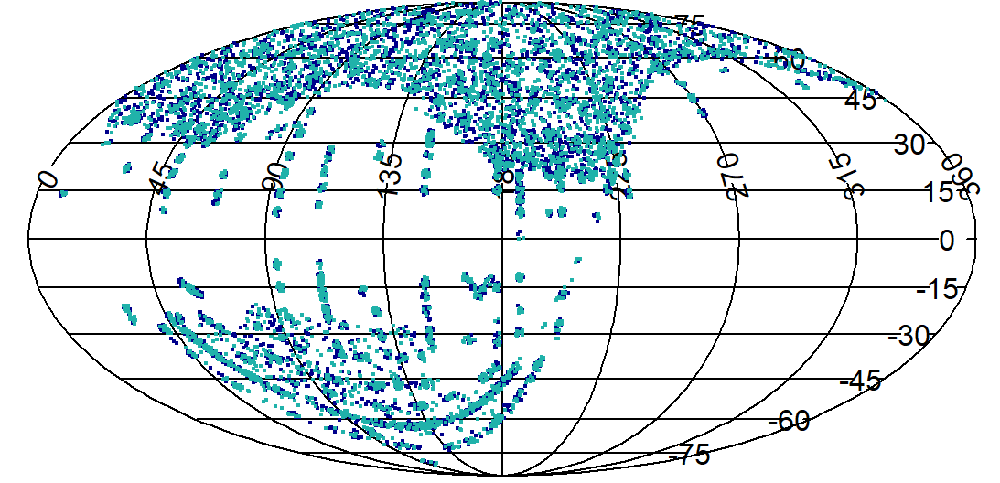

# AandA-2022-Locus-ML
Repository for background material for Astronomy and Astrophysics Publication on Using Machine Learning to Predict the Correlation of Spectra Using SDSS Colour Magnitudes as an Improvement to the Locus Algorithm.

It contains R and SQL source code, SDSS downloaded data files, and the main machine models that were created.

Note, the SQL code is contained within the _make-data.R_ file, and is commented out at the moment.

The _data_ directory contains four csv files: the list of all relevant stars in SDSS with spectra, a test-train set of star pairs, a validation et of star pairs,  and a validate-extra set of star pairs.

The _R_ directory contains four sub-directories: one with the code to make the datasets in the  _data_ directory, one with the code to make the five ML models, as well as the models themselves and the preProcessing steps, one with the code to make the seven figures in the publication, and the last to make the values in the two tables of the publication.

